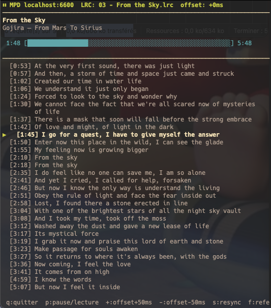

```
██╗  ██╗ █████╗ ██████╗  █████╗  ██████╗ ██╗  ██╗ █████╗ ██╗   ██╗
██║ ██╔╝██╔══██╗██╔══██╗██╔══██╗██╔═══██╗██║ ██╔╝██╔══██╗╚██╗ ██╔╝
█████╔╝ ███████║██████╔╝███████║██║   ██║█████╔╝ ███████║ ╚████╔╝
██╔═██╗ ██╔══██║██╔══██╗██╔══██║██║   ██║██╔═██╗ ██╔══██║  ╚██╔╝
██║  ██╗██║  ██║██║  ██║██║  ██║╚██████╔╝██║  ██╗██║  ██║   ██║
╚═╝  ╚═╝╚═╝  ╚═╝╚═╝  ╚═╝╚═╝  ╚═╝ ╚═════╝ ╚═╝  ╚═╝╚═╝  ╚═╝   ╚═╝
```

> Synchronized lyrics in your terminal, powered by [MPD](https://www.musicpd.org/).

A minimalist curses-based karaoke client that follows whatever MPD is playing and renders timed lyrics (`.lrc`) line by line, with auto-fetch when a track has no local lyrics file.



---

## Features

- Live sync with MPD's elapsed time, with adjustable offset
- Auto-detects `music_directory` via MPD `config` command or by parsing standard `mpd.conf` locations
- Looks for `.lrc` files next to the audio file **and** in user-supplied lyrics directories
- Optional auto-fetch of synchronized lyrics through [`syncedlyrics`](https://github.com/moehmeni/syncedlyrics)
- Reconnects automatically if MPD goes away
- Clean color-coded UI (past / current / upcoming lines)

---

## Requirements

- Python 3.10+
- An MPD instance you can reach
- [`python-mpd2`](https://pypi.org/project/python-mpd2/)
- *(Optional)* [`syncedlyrics`](https://pypi.org/project/syncedlyrics/) for online lyrics fetch
- *(Windows only)* `windows-curses`

```bash
pip install python-mpd2 syncedlyrics
# Windows additionally:
pip install windows-curses
```

---

## Usage

```bash
./karaokay.py [options]
```

### Common invocations

```bash
# Default — connects to localhost:6600, fetches lyrics on demand
./karaokay.py

# Remote MPD with password
./karaokay.py --host mpd.lan --port 6600 --password hunter2

# Pin a music directory and a dedicated lyrics folder
./karaokay.py --music-dir ~/Music --lyrics-dir ~/.lyrics

# Disable online fetching entirely
./karaokay.py --no-autofetch
```

### CLI flags

| Flag | Default | Description |
|------|---------|-------------|
| `--host` | `$MPD_HOST` or `localhost` | MPD host |
| `--port` | `$MPD_PORT` or `6600` | MPD port |
| `--password` | `$MPD_PASSWORD` | MPD password |
| `--music-dir` | `$MPD_MUSIC_DIR` | Audio root (used to find `.lrc` next to files) |
| `--lyrics-dir` | `~/.lyrics` | Lyrics folder (repeatable) |
| `--offset` | `0` | Initial sync offset in ms |
| `--no-autofetch` | off | Disables `syncedlyrics` online fetch |

---

## Keyboard shortcuts

| Key | Action |
|-----|--------|
| `q` / `Esc` | Quit |
| `p` | Play / pause toggle |
| `+` | Push lyrics 50 ms later |
| `-` | Pull lyrics 50 ms earlier |
| `s` | Resync — reload the `.lrc` for the current track |
| `f` | Force re-fetch lyrics for the current track |

---

## Where lyrics files are looked up

1. Same folder as the audio file (e.g. `~/Music/Album/Track.lrc`)
2. Each `--lyrics-dir`, checked in order, with these filename patterns:
   - `<Artist> - <Title>.lrc`
   - `<Title>.lrc`
   - `<original basename>.lrc`

When auto-fetch is enabled and no local file is found, `syncedlyrics` is queried in a background thread. The fetched file is saved next to the audio file when possible, otherwise in the first `--lyrics-dir`.

---

## Notes

- The Musixmatch provider in `syncedlyrics` occasionally returns HTTP 401 — those log lines are silenced by default; other providers (LrcLib, NetEase) keep working transparently.
- Lyrics rendering is colorized: dim for past/upcoming lines, bold white for the active line, with a `▶` cursor in front.

---

## License

MIT — do whatever you want with it.
